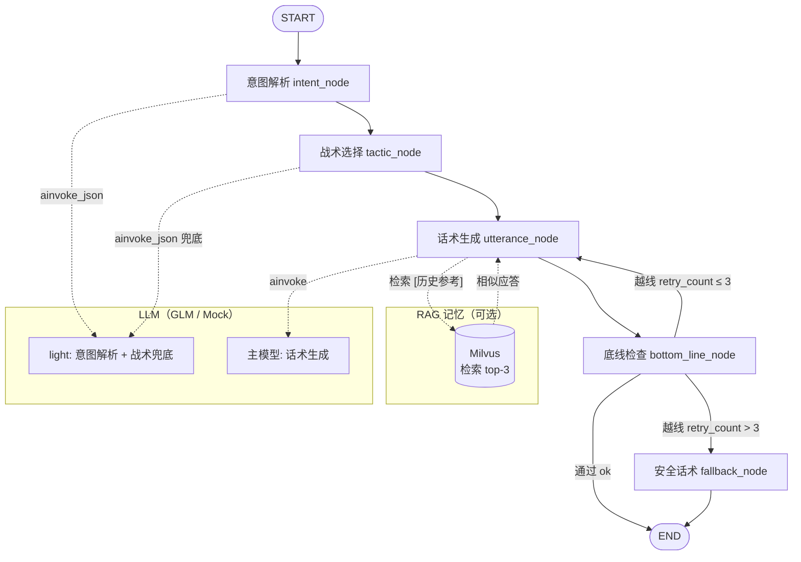
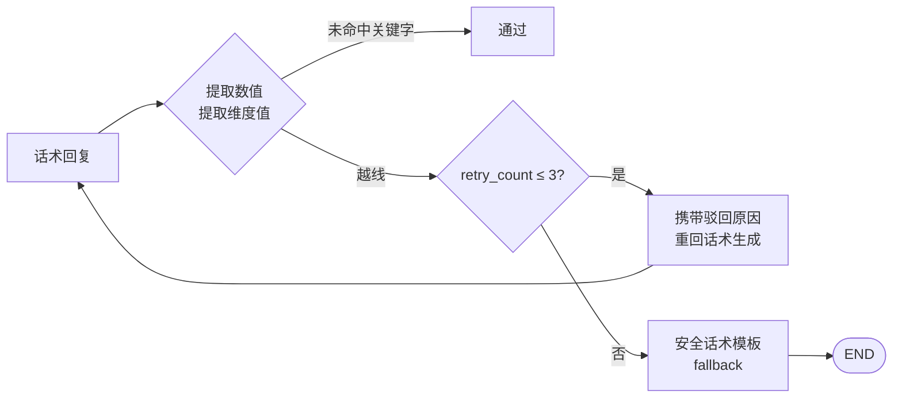
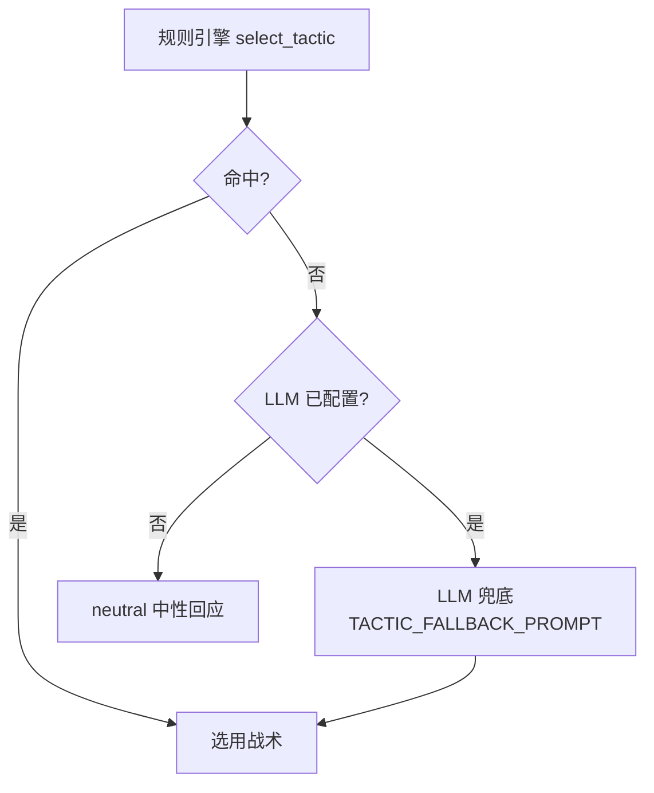
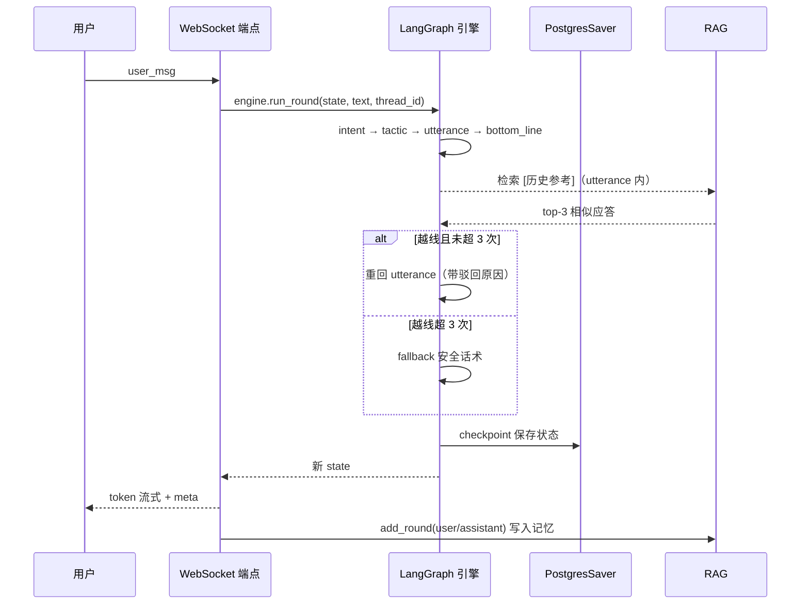
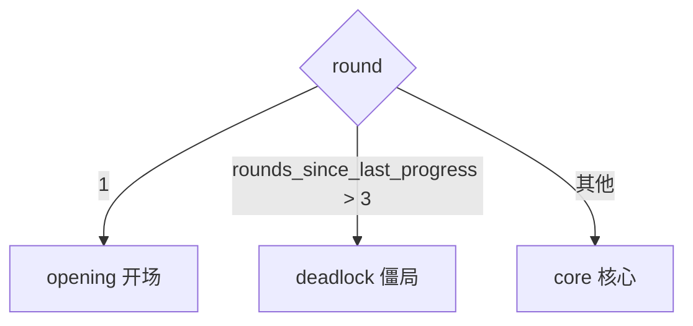

# 谋谈 MouTalk 谈判 Agent 流程图

> 与 `backend/app/engine/nodes.py::build_graph()` 代码一一对应（LangGraph StateGraph）。

## 1. 图结构总览（单轮）

## 2. 节点明细

| 节点 | 函数 | 输入 | 输出 |
|---|---|---|---|
| intent | `intent_node` (nodes.py:95) | 用户消息 | intent（intent_type/price/concessions/emotion/aggression_level），LLM 失败走规则兜底 `rule_intent` |
| tactic | `tactic_node` (nodes.py:108) | 阶段+意图+战术上下文 | selected_tactic/tactic_reason/tactic_sub_role/tactic_context |
| utterance | `utterance_node` (nodes.py:164) | 战术提示+历史+RAG 参考 | reply（回复文本） |
| bottom_line | `bottom_line_node` (nodes.py:237) | 回复+场景底线 | reply_blocked/retry_reason/bottom_line_status/opponent_offer |
| fallback | `fallback_node` (nodes.py:263) | 场景安全模板 | reply（模板轮换，不越线） |

## 3. 底线检查重试流程

- `MAX_RETRY = 3`（nodes.py:26），第 4 次越线转安全模板
- 驳回原因注入重试 prompt（`[上轮被驳回] 驳回原因: ...`，nodes.py:173）
- 纯规则检查：`check_bottom_lines`（nodes.py:220），关键词 + 单位解析，无 LLM

## 4. 战术决策（tactics.py）

规则引擎 `select_tactic(ctx)` 优先；未命中且 LLM 已配置时走 LLM 兜底（nodes.py:124），再兜底 `neutral`：

10 种战术（8 常规 + 僵局打破 + 中性兜底）：

- 红脸白脸（多步，最多 2 轮）· 时间压迫 · 最后通牒 · 虚假底线
- 分而治之 · 沉默施压 · 让步诱饵 · 信息不对称 · 打破僵局 · 中性回应

## 5. 单轮时序（含持久化）

## 6. 阶段推导（derive_phase）

（nodes.py:72-78，战术选择与僵局打破均依赖该阶段）
